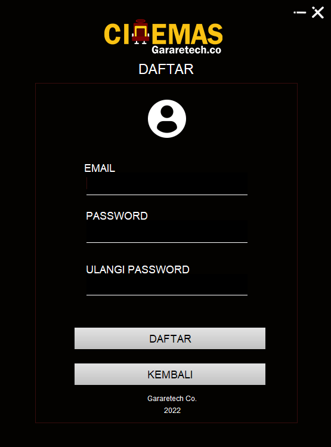
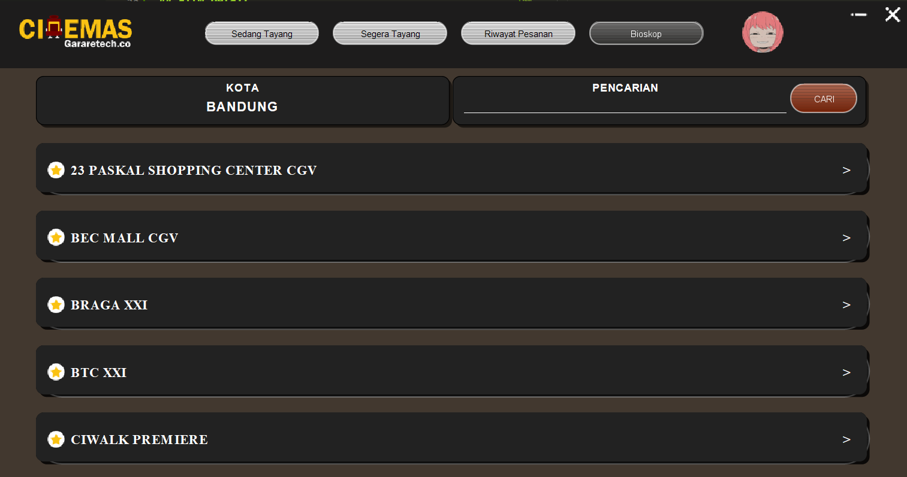

# Cinema Booking App in Java

## Requirements
- JDK 17

## Run
``` 
java -jar Cinemas.jar 
```

## Devs
- Edwin L.J
- Hanif A.S
- Ilmi F.G
- Eri S.
- Alfatih N.B

## Mockup
- https://www.figma.com/file/EIgAJHHpyIJgDkPIOgZWVW/Cinemas-App?node-id=0%3A1

### Task List

- [x] Splash Screen
- [x] Login
- [x] Register
- [x] Profile Page
- [x] Dashboard
- [x] Film Detail
- [x] Checkout Ticket
- [x] Booking Ticket
- [x] Upcoming
- [x] Order History
- [x] Cinema Site List
- [x] Cinema Detail
- [x] Bug Report Form
- [x] About Page

# Screenshot

## Splash Screen
<center></center>
<br><br><br><br>

## Login Page
<center></center>
<br><br><br><br>

## Register


## Profile
<center></center>
<br><br><br><br>

## Now Playing
<center></center>
<br><br><br><br>

## Upcoming
<center></center>
<br><br><br><br>

## Film Detail
<center></center>
<br><br><br><br>

## Choose Time
<center></center>
<br><br><br><br>

## Choose seat
<center></center>
<br><br><br><br>

## Payment success
<center></center>
<br><br><br><br>

## Order History
<center></center>
<br><br><br><br>

## Theater Site List
<center></center>
<br><br><br><br>

## Theater Detail
<center></center>
<br><br><br><br>

## Bug Report
<center></center>
<br><br><br><br>

## About Us
<center></center>
<br><br><br><br>
